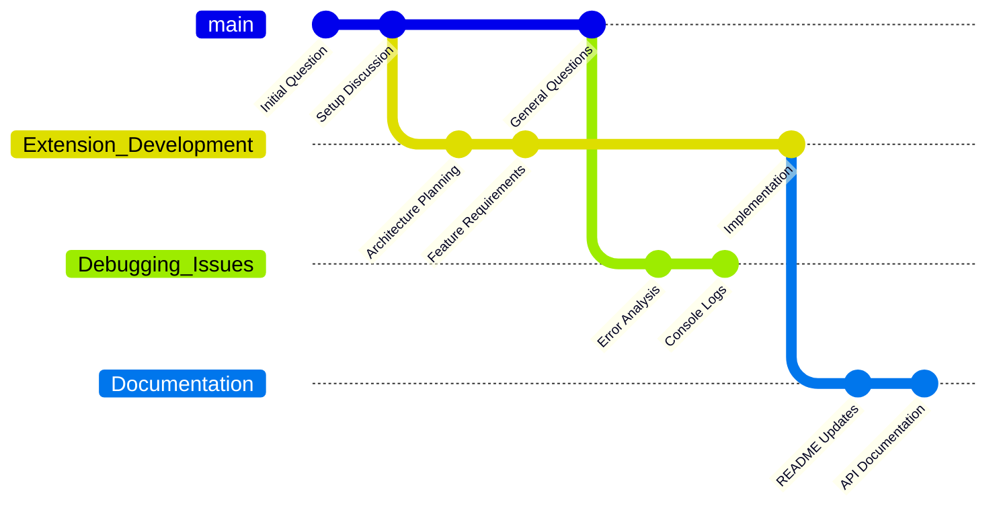
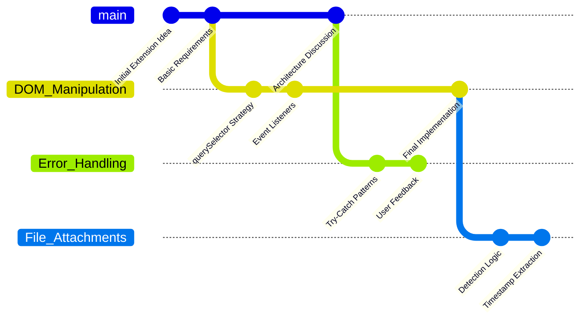

# Google AI Studio Chat Threads

Transform your long AI conversations into organized, cherry-pickable threads with Git-like workflow and visual branch mapping.

## The Problem

Long AI conversations inevitably branch into multiple topics - you start discussing one feature, then pivot to debugging, then explore new ideas, then return to implementation details. By message 50, you have a tangled mess where important discussions are scattered throughout the timeline, making it impossible to:

- **Continue a specific discussion** without losing context
- **Track thematic development** across the conversation
- **Share relevant parts** with others without overwhelming them
- **Revisit decisions** and their reasoning paths

## The Solution: Git for Conversations

This extension applies Git's branching model to AI conversations, treating each topic as a **thread branch** that can be visualized, isolated, and cherry-picked.

### 🌳 **Visual Thread Mapping**
The extension generates a **Mermaid Git graph** that visualizes your conversation like a code repository:



### 🍒 **Cherry-Pick Any Thread**
Just like Git, you can extract any branch (thread) with its complete history:
- **Main branch context**: All foundational discussion before the thread started
- **Thread-specific messages**: The focused conversation about that topic
- **Clean markdown export**: Ready to paste into a new chat for continuation

## What It Does

This extension implements a complete "Git-like" workflow for managing chat conversations:

- **🔍 Analyze conversation structure** using AI to identify thematic branches
- **📊 Generate visual thread maps** as Mermaid Git graphs
- **🍒 Cherry-pick specific threads** from complex conversations with full context
- **📎 Handle file attachments** with smart detection and timestamp tracking
- **🔄 Continue conversations** in new chats without losing historical context

### Key Features

- 🌳 **Thread Analysis**: AI-powered conversation analysis to identify thematic branches
- 🍒 **Cherry-Pick Threads**: Extract specific conversation threads with full context
- 📎 **Attachment Handling**: Smart detection of file attachments with timestamp tracking
- 🔄 **Branch Context**: Includes main branch context when copying thread branches
- 🧹 **Smart Filtering**: Automatically skips analysis prompts to avoid recursive bloat
- 📋 **Clean Markdown**: Copies threads as clean markdown for seamless pasting
- 💾 **Chat Isolation**: Separate data storage for different AI Studio conversations

## Installation

Since this extension is not on the Chrome Web Store, you can install it manually using Developer Mode.

1. **Download the Code:**
   - Go to the [Releases page](https://github.com/agentic-ai-humans/google-ai-studio-chat-threads/releases) and download the latest `Source code (zip)` file.
   - Unzip the file. You will now have a folder containing the extension files.

2. **Load the Extension in Chrome:**
   - Open Google Chrome and navigate to `chrome://extensions`.
   - Enable **"Developer mode"** using the toggle switch in the top-right corner.
   - Click the **"Load unpacked"** button that appears on the top-left.
   - Select the **`src`** folder from the files you unzipped. **Do not select the entire repository folder, only the `src` subfolder.**

The "Google AI Studio Chat Threads" extension should now appear in your list of extensions and be ready to use.

## How to Use

### Step-by-Step Workflow

#### 1. **Prepare Analysis Prompt**
- Open your conversation in Google AI Studio
- Click the extension icon in your Chrome toolbar
- Click **"1. Prepare Analysis Prompt"**
- The extension will:
  - Scrape your entire chat history (scrolling to capture all messages)
  - Filter out previous analysis prompts to avoid bloat
  - Detect file attachments with timestamps
  - Generate and paste a comprehensive analysis prompt

#### 2. **Run the Analysis**
- Press **Send** in the AI Studio chat to run the analysis
- The AI will analyze your conversation and provide:
  - **JSON mapping** of message IDs to thread names
  - **Mermaid Git graph** visualizing conversation branches
  - **Thread categorization** (e.g., "Extension Debugging", "GitHub Setup", "Feature Requests")
  
**💡 Pro Tip**: Copy the generated Mermaid code and paste it into [Mermaid Live Editor](https://mermaid.live) to see your conversation's visual thread structure!

#### 3. **Load Thread Analysis**
- Click **"2. Load Analysis"** in the extension popup
- The extension will:
  - Extract the JSON analysis from the AI's response
  - Handle collapsed expansion panels automatically
  - Populate the thread dropdown with available threads
  - Show data creation timestamp

#### 4. **Select and Copy Thread**
- Choose a thread from the **"3. Select a thread to continue:"** dropdown
- Click **"4. Copy to New Chat"**
- The extension will copy:
  - **Main branch context**: All messages before the thread started
  - **Selected thread**: All messages in the chosen thread
  - **Attachment notifications**: Clear instructions for required files
  - **Thread metadata**: Message counts, branch points, and context info

#### 5. **Continue in New Chat**
- Open a new Google AI Studio chat
- Paste the copied content
- Re-upload any required attachments (clearly listed with timestamps)
- Continue your conversation with full context

### 🌟 **The Magic: Mermaid Thread Visualization**

The extension's killer feature is transforming your chaotic conversation into a beautiful Git-style branch diagram:

#### **Before: Linear Message Hell**
```
Message 1: Initial question about extension
Message 2: How to handle DOM manipulation?
Message 3: Actually, let's discuss architecture first
Message 4: What about error handling?
Message 5: Back to DOM - use querySelector
Message 6: New idea: what about file attachments?
Message 7: Error handling should use try-catch
Message 8: File attachments are complex...
Message 50: Wait, what were we building again?
```

#### **After: Clear Thread Structure**


#### **How It Works**
1. **AI Analysis**: The AI identifies thematic clusters in your conversation
2. **Branch Detection**: Messages are mapped to threads (branches) based on topic similarity
3. **Git Graph Generation**: Creates a Mermaid diagram showing how discussions evolved and branched
4. **Visual Navigation**: You can see exactly how ideas developed and where conversations split

This transforms conversation archaeology from "scroll and search" to "visual navigation"!

### Advanced Features

#### **Attachment Handling**
When conversations include file attachments, the extension:
- Detects files with names, types, and token counts
- Extracts upload timestamps when available
- Provides clear instructions for file re-upload
- Lists required files with timestamps to distinguish duplicates

Example attachment notice:
```
⚠️ IMPORTANT - ATTACHMENTS REQUIRED:
This conversation references 2 file(s) that were attached in the original chat:

- Test Tornada.md (43,655 tokens) - uploaded 2024-12-15T14:30:22
- business-plan.pdf (12,543 tokens) - uploaded 2024-12-15T09:15:45

Finding your files: Look in your Google AI Studio file manager for files with these exact names and upload times.
```

#### **Smart Branch Context**
Unlike simple filtering, the extension provides **full context** by including:
- All messages from the main conversation **before** the selected thread branched off
- All messages from the selected thread
- Clear labeling of which messages belong to "Main Branch" vs the selected thread

#### **Data Management**
- **Chat Isolation**: Each conversation has separate data storage
- **Clear Data**: Button to clear stored data with timestamp reference
- **Version Display**: Shows plugin version (v3.0.0) in bottom-left corner
- **Cross-Chat Detection**: Only shows data relevant to the current chat

## Example Use Cases

### 🔧 **Technical Debugging Session**
**Scenario**: 100-message conversation jumping between frontend bugs, database issues, and new feature ideas.

**With the extension**:
1. **Visual mapping** reveals 4 distinct threads: "Database Performance", "UI Bugs", "Authentication", "New Features"
2. **Thread isolation**: Extract just "Database Performance" with its 23 relevant messages
3. **Context preservation**: Include foundational database architecture discussion from main branch
4. **Focused continuation**: New chat starts with complete technical context, no confusion

**Result**: Instead of scrolling through 100 messages to find database-related discussions, you get a clean 23-message thread with perfect context.

### 📝 **Document Review Process**
1. Conversation analyzing multiple documents with attachments
2. Cherry-pick the "Contract Terms" thread
3. Copy with clear file requirements and timestamps
4. Continue legal review with proper document context

### 🎯 **Feature Development**
1. Brainstorming session with multiple feature ideas
2. Extract "User Authentication" thread with main branch context
3. Continue implementation discussion with full technical background
4. Maintain conversation history and decision context

## Technical Details

### Architecture
- **Manifest V3** Chrome extension
- **Content Script**: Handles DOM manipulation and chat analysis
- **Popup Interface**: Numbered workflow buttons for user interaction
- **Storage**: `chrome.storage.local` for persistent data with chat isolation

### Key Components
- **Smart Scrolling**: Climbs through chat history to capture all messages
- **DOM Analysis**: Robust parsing of Google AI Studio's Angular components
- **JSON Extraction**: Handles various AI response formats (markdown, collapsed panels)
- **Attachment Detection**: Comprehensive file detection with metadata extraction
- **Branch Logic**: Intelligent context assembly for thread continuity

### Browser Compatibility
- **Chrome**: Full support (Manifest V3)
- **Edge**: Compatible with Chromium-based versions
- **Other browsers**: Not supported (uses Chrome extension APIs)

## Troubleshooting

### Common Issues

**"No analysis found"**
- Ensure the AI has finished responding
- Check that the response contains valid JSON
- Try clicking "2. Load Analysis" after the AI completes

**"Error communicating with the page"**
- Refresh the Google AI Studio page
- Reload the extension
- Ensure you're on a valid AI Studio chat page

**Missing attachments**
- Check console logs for attachment detection
- Verify files are visible in the original chat
- Use timestamps to find correct files in AI Studio file manager

**Extension not working**
- Verify you're on `aistudio.google.com`
- Check that the extension is enabled in Chrome
- Look for console errors (F12 → Console tab)

## Version History

### v3.0.0 (Current)
- Complete Git-like workflow implementation
- Smart attachment handling with timestamps
- Branch context preservation
- Chat isolation and data management
- Enhanced error handling and logging

## License

This project is licensed under the **MIT License**. See the `LICENSE` file for details.

## Contributing

Found a bug or have an idea for a new feature? Feel free to [open an issue](https://github.com/agentic-ai-humans/google-ai-studio-chat-threads/issues) in this repository.

### Development

The extension consists of:
- `manifest.json` - Extension configuration
- `popup.html/js` - User interface and interaction logic
- `content_script.js` - Main functionality for chat analysis and thread extraction
- `icons/` - Extension icons for Chrome toolbar

To contribute:
1. Fork the repository
2. Make your changes in the `src/` directory
3. Test with Chrome Developer Mode
4. Submit a pull request with clear description

---

**Transform your AI conversations from linear chats into organized, navigable thread structures. Perfect for complex projects, research sessions, and collaborative AI workflows.**